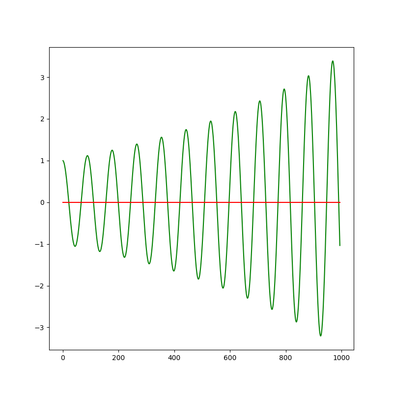
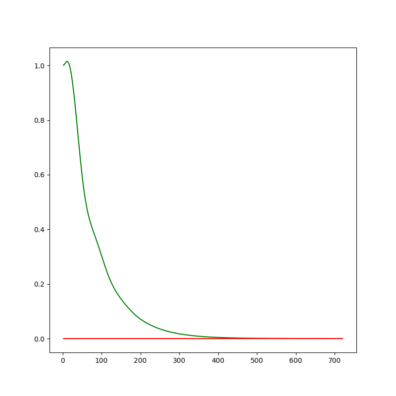

# PID Controller Project Starter Code
Self-Driving Car Engineer Nanodegree Program

In this project I will utilize a PID Controller in the simulator. 

The goals / steps of this project are the following:

* 1.Your code should compile.
* 2.The PID procedure follows what was taught in the lessons.
* 3.Describe the effect each of the P, I, D components had in your implementation.
* 4.Describe how the final hyperparameters were chosen.
* 5.The vehicle must successfully drive a lap around the track.


### [Rubric](https://review.udacity.com/#!/rubrics/824/view) Points
### Here I will consider the rubric points individually and describe how I addressed each point in my implementation.  

#### 1.Your code should compile.
I compile project by following instructions:

1. mkdir build
2. cd build
3. cmake ..
4. make
5. ./pid

#### 2.The PID procedure follows what was taught in the lessons.
Here is the PID formula:
<div class="test">

</div>


#### 3.Describe the effect each of the P, I, D components had in your implementation.

P: 0.100513   
P (proportional): Reference the CTE(Current Track Error), the steer angle of the vehicle is adjusted proportionally. If the CTE(Abs) is large, the steering angle will also become larger toward the reference trajectory. Otherwise, if the CTE is small, the steering angle will also decrease. However, the parameter P will swing the vehicle.  
Here is a image for parameter P:  
<div class="test">

</div>

And here is a video for parameter P:
[video](./Docs/video_p.mp4)
  
I: 0.002906  
I (integral): Because parameter P will cause the vehicle to swing up and down near the reference trajectory, so add parameter I to reduce the amplitude of the swing, so that the vehicle can smoothly approach the reference trajectory.  
Here is a image for parameter I:  
<div class="test">

</div>

And here is a video for parameter I:
[video](./Docs/video_i.mp4)


D: 7.1  
D (differential): If the vehicle steering has some little error, so the vehicle can not approach the reference trajectory correctly. The parameter D can  compensate the vehicle steering error.  
Here is a image for parameter D:  
<div class="test">

</div>

And here is a video for parameter D:
[video](./Docs/video_d.mp4)

#### 4.Describe how the final hyperparameters were chosen.
I use twiddle to determine the final hyperparameters, the code of twiddle in main_twiddle.cpp.  
Here is a code fragment  

```

          if(num > 300){
              //std::string msg = "42[\"reset\",{}]";
              //ws.send(msg.data(), msg.length(), uWS::OpCode::TEXT);
              //num = 0;
              //std::cout << "------------------------------" << std::endl;

              if(loopflag >= 1 && loopflag <= 2){

                  if(flag == 0){
                      p_p += dp_p;

                      if(err < best_err){
                          best_err = err;
                          dp_p *= 1.1;
                      }               
                      else{
                          p_p = p_p - 2 * dp_p;
                      }

                      flag++;
                  }
                  else{

                      if(err < best_err){
                          best_err = err;
                          dp_p *= 1.1;
                      }    
                      else{
                          p_p += dp_p;
                          dp_p *= 0.9;
                      }                      

                      flag = 0;
                  }

                  loopflag++;

              }
              else if (loopflag >= 3 && loopflag <= 4){

                  if(flag == 0){
                      p_i += dp_i;
                      
                      if(err < best_err){
                          best_err = err;
                          dp_i *= 1.1;
                      }    
                      else{
                          p_i = p_i - 2 * dp_i;
                      }
                      
                      flag++;
                  }
                  else{
                      
                      if(err < best_err){
                          best_err = err;
                          dp_i *= 1.1;
                      }    
                      else{
                          p_i += dp_i;
                          dp_i *= 0.9;
                      }
                      
                      flag = 0;
                  }

                  loopflag++;
              }
              else if (loopflag >= 5 && loopflag <= 6){

                  if(flag == 0){
                      p_d += dp_d;
                      
                      if(err < best_err){
                          best_err = err;
                          dp_d *= 1.1;
                      }    
                      else{
                          p_d = p_d - 2 * dp_d;
                      }
                      
                      flag++;
                  }
                  else{
                      
                      if(err < best_err){
                          best_err = err;
                          dp_d *= 1.1;
                      }    
                      else{
                          p_d += dp_d;
                          dp_d *= 0.9;
                      }
                      
                      flag = 0;
                  }

                  if(loopflag == 5){
                      loopflag++;
                  }
                  else{
                      loopflag = 1;
                  }

              }


              //pid.Init(p_p + dp_p, p_i + dp_i, p_d + dp_d);
              pid.Init(p_p, p_i, p_d);

```


#### 5.The vehicle must successfully drive a lap around the track.
My car is in the simulator, it is swaying sometimes, but it does not fall out of the road.  
Here's a link to my [video](./Docs/video.mp4) result  
